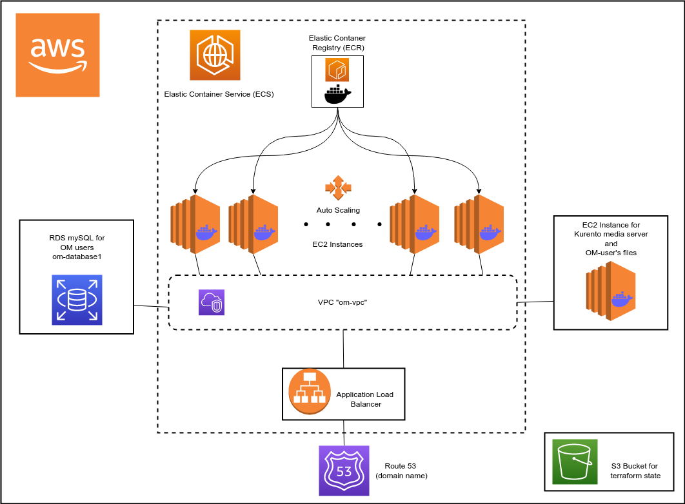

### This repository contains the terraform code for building the AWS infrastructure for Sergei Aleshkevich's graduation project 
(https://github.com/serwol2/openmeetings-dp)

#### Provisioning VPC, ECS, ALB and EC2 for openmeetings-dp using Terraform

- Virtual Private Cloud (VPC) with 2 public subnets in 2 availability zones
- Elastic Container Service (ECS)
- Application Load Balancer (ALB)
- EC2 instance for Kurento Media Server 
- S3 bucket and ...databese.. for terraform state (in future, may be from CLI)
- Database in Relational Database Service (RDS) (in future)

#### How to create the infrastructure?

1. terraform init
2. terraform plan
3. terraform apply

Note: it can take about 10 minutes to provision all resources.
#### How to delete the infrastructure?
1. Terminate ALB and ASG
2. terraform destroy